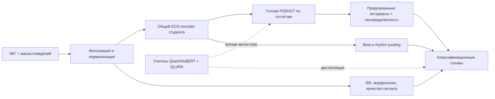

# Следующие эксперименты — предложение, не запущено

## Дополнительные датасеты: требуется утверждение

Ничего из списка ниже не скачано. Приоритет — закрыть слабую эпизодную ЖТ и наджелудочковую экстрасистолию, а не просто увеличить число записей.

| Приоритет | Кандидат | Что добавляет | Ограничения |
|---|---|---|---|
| 1 | [MIT-BIH Malignant Ventricular Ectopy / VFDB](https://physionet.org/content/vfdb/1.0.0/) | 22 получасовые записи, 33.1 МБ; разметка ритмов VT/VFL/VF, пригодна для эпизодной оценки | Нет beat-меток и границ P/QRS/T; не подменять ими разметку сокращений |
| 2 | [MIT-BIH Supraventricular Arrhythmia / SVDB](https://physionet.org/content/svdb/1.0.0/) | 78 получасовых записей, дополнительные примеры наджелудочковых аритмий | Проверить идентичности и пересечения с существующими данными и источниками SSL |
| 3 | [MIT-BIH AFDB](https://physionet.org/content/afdb/1.0.0/) | 25 длинных записей с разметкой ритма; сигналы доступны для 23 | Подходит для эпизодов ФП, но не для «впервые выявленной/постоянной» формы без истории |
| Дополнение разметки | [BUT PDB](https://physionet.org/content/but-pdb/1.0.0/) | Ручные пики P на сложных ритмах | Собран из MIT-BIH/SVDB/LTAFDB: это дополнительные аннотации существующих источников, а не автоматически независимый датасет; пики не равны onset/offset |

INCART/St Petersburg и PTB-производные сначала сопоставить с уже имеющимися Training_StPetersburg/PTB. Повторное скачивание той же записи не увеличивает независимую выборку. Подтверждение отсутствия пересечений текущих датасетов не переносится автоматически на новые источники и корпуса предобучения.

После утверждения: сначала зафиксировать версии/лицензии/хеши, patient/source manifest и отдельный закрытый контроль. Только затем обучать/адаптировать на заранее выделенной train-части. Для учителя с неизвестным составом предобучения ограничение явно сохраняется.

## Одна модель для двух задач: да, но teacher/student — способ обучения

Предлагаю один **развёртываемый студент с общим ECG encoder и двумя основными головами**. Учитель помогает обучению и не нужен при обычном инференсе. Называть разметчик учителем, а классификатор учеником неточно: они имеют разные целевые выходы; корректнее передавать знания по каждой задаче.

**Предобработка и features разрешены и полезны.** На CPU: фильтрация, ресэмплинг с физическим временем, quality/missing-lead masks, RR и локальные морфологические признаки. В классификаторе: embeddings сигнала, интервалы, признаки отсутствующих/неуверенных границ. Фичи должны существовать при инференсе; ground-truth интервалы нельзя подавать в классификатор вместо предсказанных. При раздельном обучении использовать out-of-fold предсказания разметчика для train классификатора.

**Учитель:** сначала сравнить уже реализованные U-Net, HuBERT LoRA/QLoRA и Qwen QLoRA. Размер не делает Qwen надёжным учителем ЭКГ. Если он проигрывает, разумнее экспертный ансамбль учителей по задачам; конечный студент всё равно один. QLoRA экономит память замороженных весов, но не доказывает качество и не заменяет обучение ECG-адаптера.

**Студент:** lead-aware Conv1D encoder + небольшой bidirectional Transformer, общий backbone; sample head для P/QRS/T, beat head N/S/V/F и rhythm/multilabel head для заболеваний. Ученик порядка 5–20 млн параметров — стартовая гипотеза, не измеренная оптимальная архитектура. Lead masking при обучении и маска наличия каналов обязательны для разнородных входов.

**Обучение с неполными метками:** supervised segmentation loss только там, где есть границы; beat loss только для достоверных сокращений; multilabel loss с маской неизвестных диагнозов. Teacher KL/feature loss — только на train-записях, с отдельными весами и фильтрацией уверенности, без насильственного заполнения пропущенной разметки. Истинные метки имеют приоритет над псевдометками. Балансировать minibatch по датасетам и задачам, а не смешивать отсутствующие диагнозы с отрицательными.

**Что сравнить на одинаковых пациентах:** (A) существующий составной маршрут; (B) multitask студент без учителя; (C) студент с дистилляцией; (D) тот же студент без инженерных features; (E) QLoRA-учитель напрямую. Отдельно сравнить случайную и предобученную основу Qwen, чтобы проверить пользу языкового предобучения. Оценивать P/QRS/T event F1 и границы, QRS-width MAE, S/V end-to-end F1, эпизодную ЖТ/ФП и false alarms/hour, multilabel AUROC/AUPRC. Нужны оценки по источникам, отведениям и пациентам; один средний score не закрывает все задачи.

Основание дистилляции — [Hinton et al.](https://arxiv.org/abs/1503.02531). [Time-LLM](https://arxiv.org/abs/2310.01728) исследует перепрограммирование LLM для временных рядов; его результаты по forecasting не являются доказательством качества ECG-разметки. Предложенная здесь multitask teacher/student схема **ещё не реализована и не измерена**; реализованы отдельные сравниваемые ветви.
